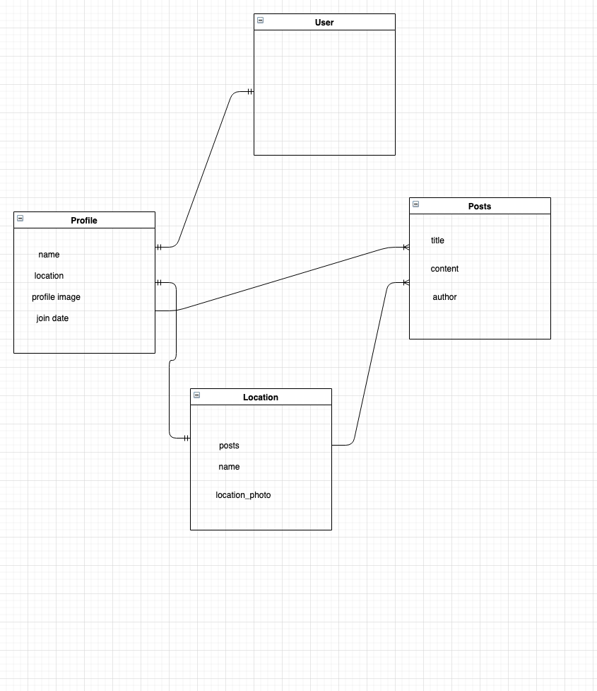

# Wayfarer

## ERD 

## User Story

1. User can sign up for an account and log in if they have one 
2. Upon login, user will be redirected to profile page 
3. In profile page, user will see their name, current city that they have set in their profile, profile image and their join date 

4. User can update their profile by changing their name and/or city 
5. User can create posts for cities 
6. User can see titles of all posts they've contributed

7. User can click on titles of posts to be redirected to a "show" for that post 
8. The show page for the post will display its title, author and content 
9. Users can view pages for different cities 

10. Pages for cities will have the name of that city and related photos 
11. Users can view a list of posts for that city and filter 
12. Users can create posts for cities as well as edit, delete, and update posts 

